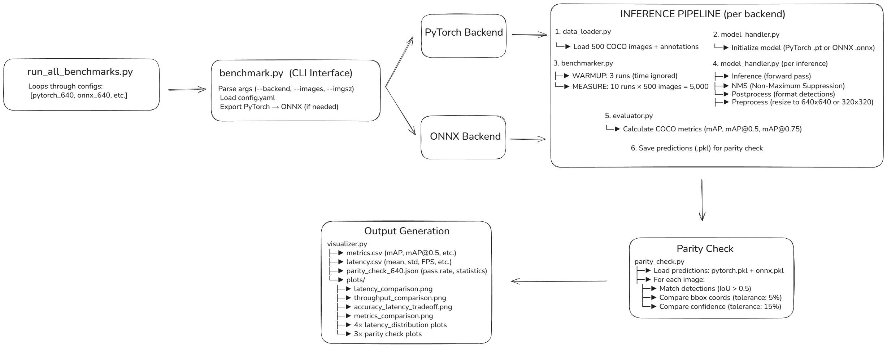

# YOLOv8n Benchmark: PyTorch vs ONNX

**A comprehensive benchmark framework comparing PyTorch and ONNX inference performance for YOLOv8n object detection.**

## Key Results
- **2.4× speedup** at 640×640 (ONNX vs PyTorch)
- **3.9× speedup** at 320×320 (ONNX vs PyTorch)
- Minimal accuracy loss: only 1.2% at 640×640
- ONNX actually **beats** PyTorch at 320×320

## Model & Dataset

**YOLOv8n** (Ultralytics)
- Parameters: ~3M
- Size: ~6 MB
- Pretrained on COCO dataset

**COCO 2017 Validation Subset**
- 500 images (seed=42)
- 3,842 object instances
- 80 object categories

---

## Benchmark Pipeline

<p align="center">
  
</p>

---

## Benchmark Results

| Configuration | mAP@0.5 | Latency | Throughput | Speedup |
|---------------|---------|---------|------------|---------|
| pytorch_640   | 43.78%  | 101.1 ms | 9.9 FPS   | baseline |
| **onnx_640**  | 42.57%  | 42.0 ms | 23.8 FPS  | **2.4×** |
| pytorch_320   | 32.81%  | 44.0 ms | 22.7 FPS  | baseline |
| **onnx_320**  | 33.11%  | 11.3 ms | 88.6 FPS  | **3.9×** |

---

## Installation

### 1. Create Environment (Conda)

```bash
conda env create -f environment.yml
conda activate trio-demo
```

### 2. Or Use pip + venv

```bash
python -m venv venv
venv\Scripts\activate  # Windows
source venv/bin/activate  # Linux/Mac
pip install -r requirements.txt
```

---

## Usage

### Run All Benchmarks (Recommended)

```bash
# Default: 500 images, both resolutions (640 and 320)
python run_all_benchmarks.py

# Custom number of images
python run_all_benchmarks.py --images 300

# Only 640×640 resolution
python run_all_benchmarks.py --images 500 --imgsz 640

# Only 320×320 resolution
python run_all_benchmarks.py --images 500 --imgsz 320
```

This will:
- Benchmark all configurations: `pytorch_640`, `onnx_640`, `pytorch_320`, `onnx_320`
- Run parity checks at both resolutions
- Generate all metrics, reports, and visualizations
- Save everything to `results/` directory

**Output**: `metrics.csv`, `latency.csv`, `parity_check_*.json`, and 11 plots

**Arguments:**
- `--images`: Number of images to test (default: 500)
- `--imgsz`: Specific resolution: 320 or 640 (default: both)

---

### Run Individual Benchmarks

```bash
# PyTorch at 640×640
python benchmark.py --backend pytorch --imgsz 640 --images 500

# ONNX at 640×640
python benchmark.py --backend onnx --imgsz 640 --images 500

# ONNX at 320×320 (fastest)
python benchmark.py --backend onnx --imgsz 320 --images 500
```

**CLI Arguments:**
- `--backend`: `pytorch` or `onnx`
- `--imgsz`: Input resolution (640 or 320)
- `--images`: Number of images to test (default: 500)
- `--config`: Custom config file (default: `configs/config.yaml`)

---

## Project Structure & Outputs

```
trio-demo/
├── benchmark.py              # CLI for single benchmark
├── run_all_benchmarks.py     # Run all 4 configs + parity checks
├── configs/config.yaml       # Configuration (IoU=0.7, conf=0.25)
│
├── src/                      # Source modules
│   ├── data_loader.py        # Load 500 COCO images + annotations
│   ├── model_handler.py      # PyTorch/ONNX inference + NMS
│   ├── benchmarker.py        # Warmup (3 runs) + Measure (10 runs/image)
│   ├── evaluator.py          # Calculate COCO mAP metrics
│   ├── parity_check.py       # Compare PyTorch vs ONNX outputs
│   └── visualizer.py         # Generate comparison plots
│
├── data/coco_subset/         # 500 images from COCO 2017 val
│   ├── images/               # Image files
│   └── annotations/          # COCO format JSON
│
├── models/
│   ├── yolov8n.pt            # PyTorch model
│   ├── yolov8n_640.onnx      # ONNX model (640×640)
│   └── yolov8n_320.onnx      # ONNX model (320×320)
│
└── results/                  # Generated outputs
    ├── metrics.csv           # Accuracy: mAP, mAP@0.5, mAP@0.75
    ├── latency.csv           # Performance: mean, std, FPS
    ├── parity_check_640.json # PyTorch vs ONNX at 640 (83.8% pass)
    ├── parity_check_320.json # PyTorch vs ONNX at 320 (89.4% pass)
    └── plots/                # 11 visualization plots
        ├── latency_comparison.png
        ├── throughput_comparison.png
        ├── accuracy_latency_tradeoff.png
        └── ... (8 more plots)
```

---

## Key Implementation Details

### Benchmark Methodology
- **Warmup**: 3 inference runs (results discarded)
- **Measurement**: 10 runs per image × 500 images = 5,000 inferences
- **Metrics**: Mean, std dev, percentiles (P95, P99)
- **NMS Settings**: IoU=0.7, Confidence=0.25 (YOLOv8 defaults)

### Parity Check
Validates PyTorch ↔ ONNX output consistency:
- **IoU matching**: Threshold 0.5
- **BBox tolerance**: ±5% relative difference
- **Confidence tolerance**: ±15% absolute difference
- **Results**: 83.8% pass at 640, 89.4% pass at 320

### Files Explained

| File | Purpose |
|------|---------|
| `benchmark.py` | Single backend CLI (manual control) |
| `run_all_benchmarks.py` | Automated runner for all 4 configs |
| `data_loader.py` | Load 500 COCO images with annotations |
| `model_handler.py` | Initialize models and run inference |
| `benchmarker.py` | Measure latency with warmup phase |
| `evaluator.py` | Calculate COCO mAP metrics |
| `parity_check.py` | Compare PyTorch vs ONNX detections |
| `visualizer.py` | Generate comparison charts |

---

## Quick Start Example

```bash
# 1. Setup
conda activate trio-demo

# 2. Run everything (takes ~5-10 minutes)
python run_all_benchmarks.py

# 3. Check results
cat results/metrics.csv
cat results/latency.csv
open results/plots/latency_comparison.png  # or start on Windows
```

---

## Citation

```bibtex
@software{yolov8n_benchmark,
  title={YOLOv8n Benchmark: PyTorch vs ONNX},
  author={trio-demo},
  year={2026}
}
```
